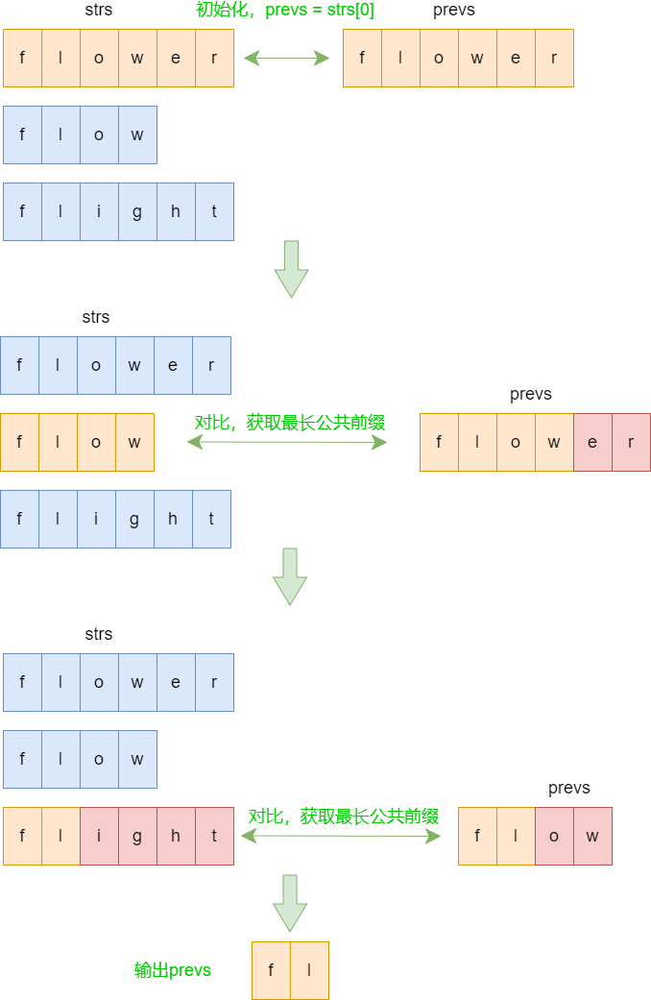
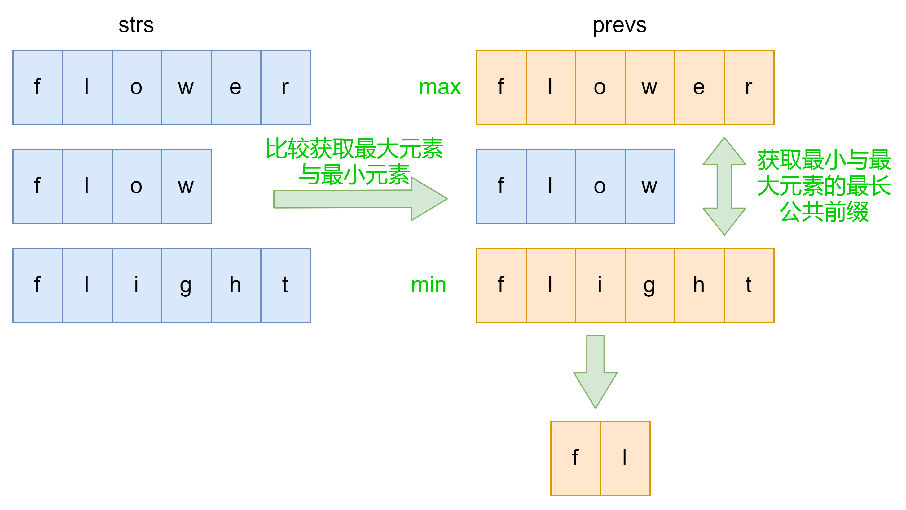

### leetcode14：最长公共前缀

编写一个函数来查找字符串数组中的最长公共前缀。

如果不存在公共前缀，返回空字符串 `""`。

**示例1：**

```
输入：strs = ["flower","flow","flight"]
输出："fl"
```

**示例2：**

```
输入：strs = ["dog","racecar","car"]
输出：""
解释：输入不存在公共前缀。
```

**提示：**

- `1 <= strs.length <= 200`
- `0 <= strs[i].length <= 200`
- `strs[i]` 仅由小写英文字母组成


### 解法一：逐个比较

思路：从前往后依次比较字符串，获取公共前缀



```js
var longestCommonPrefix = function(strs) {
  if(strs === null || strs.length === 0) return ''
  let prevs = strs[0]
  for(let i=1; i<strs.length; i++) {
    let j=0
    for(; j<prevs.length && j<strs[i].length; j++) {
      if(prevs.charAt(j) !== strs[i].charAt(j)) break
    }
    prevs = prevs.substring(0, j)
    if(prevs === '') return ''
  }
  return prevs
}
```


### 解法二：仅需最大、最小字符串的最长公共前缀

**解题思路：**获取数组中的最大值及最小值字符串，最小字符串与最大字符串的最长公共前缀也为其他字符串的公共前缀，即为字符串数组的最长公共前缀。

例如：abc、abcd、ab、ac，最小 ab 与最大 ac 的最长公共前缀一定也是 abc 、abcd 的公共前缀

使用大于小于号比较字符串的时候，自动就会把最开始出现不同的两个元素比较出来。



**代码实现：**

```js
var longestCommonPrefix = function(strs) {
  if(strs === null || strs.length === 0) return "";
  if(strs.length === 1) return strs[0];
  let min = 0, max = 0;
  // 找出max和min
  for(let i=1; i<strs.length; i++) {
    if(strs[min] > strs[i]) min = i;
    if(strs[max] < strs[i]) max = i;
  }
  for(let j=0; j<strs[min].length; j++) {
    if(strs[min].charAt(j) !== strs[max].charAt(j)) {
      return strs[min].substring(0, j);
    }
  }
  return strs[min]
}
```


### 解法三：分治策略，归并思想

​		分治，顾名思义，就是分而治之，将一个复杂的问题，分成两个或多个相似的子问题，在把子问题分成更小的子问题，直到更小的子问题可以简单求解，求解子问题，则原问题的解则为子问题解的合并。

这道题就是一个典型的分治策略问题：

- 问题：求多个字符串的最长公共前缀
- 分解成多个相似的子问题：求两个字符串的最长公共前缀
- 原问题的解为子问题解的合并：多个字符串的最长公共前缀为两两字符串的最长公共前缀的最长公共前缀，我们可以归并比较两最长公共前缀字符串的最长公共前缀，直到最后归并比较变为一个，则为字符串数组的最长公共前缀：LCP(S1，S2，S3，...，Sn) = LCP(LCP(S1，Sk)，LCP(Sk+1，Sn))

以 abc、abcd、ab、ac为例


```js
var longestCommonPrefix = function(strs) {
  if(strs === null || strs.length === 0) return '';
  return lcPrefixRec(strs);
}
// 若分裂后的两个数组长度不为1，则继续分裂
// 直到分裂后的数组长度为1
// 然后比较获取最长公共前缀
function lcPrefixRec(arr) {
  let length = arr.length;
  if(length === 1) return arr[0];
  let mid = Math.floor(length / 2),
      left = arr.slice(0, mid),
      right = arr.slice(mid, length);
  return lcPrefixTwo(lcPrefixRec(left), lcPrefixRec(right));
}

// 求 str1 与 str2 的最长公共前缀
function lcPrefixTwo(str1, str2) {
  let j = 0;
  for(; j<str1.length && j<str2.length; j++) {
    if(str1.charAt(j) !== str2.charAt(j)) break;
  }
  return str1.substring(0, j);
}
```


### 解法四：Trie树（字典树）

Trie树，也称字典树或前缀树，顾名思义，它是用来处理字符串匹配问题的数据结构，以及用来解决集合中查找固定前缀字符串的数据结构。

**解题思路：**

构建一个Trie树，字符串数组的最长公共序列就从根节点开始遍历树，直到：

- 遍历节点存在超过一个子节点的节点
- 或遍历节点为一个字符串的结束字符

为止，走过的字符为字符串数组的最长公共前缀

**图例：**

构建一个Trie树，以 abc、abcd、ab、ac 为例（黄色节点为结束字符）


```js
// 解法四：Trie树（字典树）
var longestCommonPrefix4 = function(strs) {
  if(strs === null || strs.length === 0) return ''
  // 初始化Trie树
  let trie = new Trie()
  // 构建Trie树
  for(let i=0; i<strs.length; i++) {
    if(!trie.insert(strs[i])) return ''
  }
  // 返回最长公共前缀
  return trie.searchLongestPrefix()
}
// Trie树
var Trie = function() {
  this.root = new TrieNode()
}
var TrieNode = function() {
  // next放入当前节点的子节点
  this.next = {};
  // 当前是否是结束节点
  this.isEnd = false;
}
Trie.prototype.insert = function(word) {
  if(!word) return false;
  let node = this.root;
  for(let i=0; i<word.length; i++) {
    if(!node.next[word[i]]) {
      node.next[word[i]] = new TrieNode()
    }
    node = node.next[word[i]]
  }
  node.isEnd = true
  return true
}
Trie.prototype.searchLongestPrefix = function() {
  let node = this.root
  let prevs = ''
  while(node.next) {
    let keys = Object.keys(node.next)
    if(keys.length !== 1) break
    prevs += keys[0]
    if(node.next[keys[0]].isEnd) break
    node = node.next[keys[0]]
  }
  return prevs
}
```


