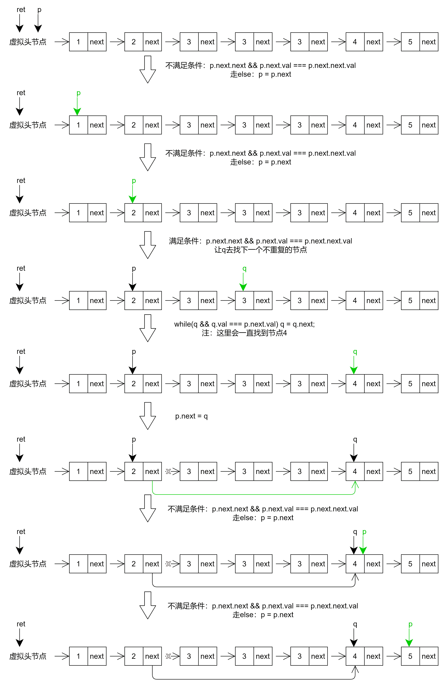

# 删除排序链表中的重复元素 II-leetcode82

<a href="https://leetcode-cn.com/problems/remove-duplicates-from-sorted-list-ii/" target="_blank">删除排序链表中的重复元素</a>

存在一个按升序排列的链表，给你这个链表的头节点 head ，请你删除链表中所有存在数字重复情况的节点，只保留原始链表中 没有重复出现 的数字。

返回同样按升序排列的结果链表。


**示例1：**

```js
输入：head = [1,2,3,3,4,4,5]
输出：[1,2,5]
```

**示例2：**

```js
输入：head = [1,1,1,2,3]
输出：[2,3]
```


**思路：**

1. 设置一个虚拟头节点ret，让p指向ret
2. 然后看看p后面的这个节点（p.next）是否产生了重复
   1. 如果产生了重复，那就一直往下找到非重复的节点，然后让p指向这个非重复的节点
   2. 否则让p向后走一步：p = p.next

```js
var deleteDuplicates = function(head) {
  if(!head) return head;
  let ret = new ListNode(0, head), p = ret, q;
  while(p.next) {
    // 产生了重复
    if(p.next.next && (p.next.val === p.next.next.val)) {
      // 让q去找下一个不重复的节点
      q = p.next.next;
      while(q && (q.val === p.next.val)) q = q.next;
      p.next = q; // 此时q是不重复的节点
    } else {
      p = p.next;
    }
  }
  return ret.next;
}
```



