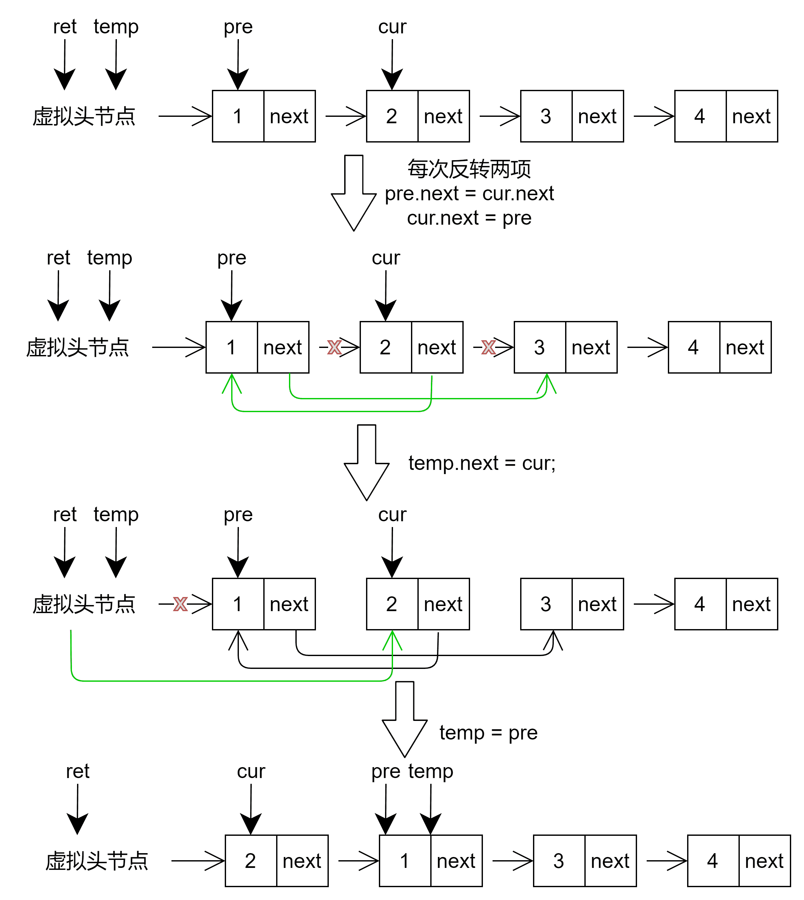

# 两两交换链表中的节点-leetcode24

<a href="https://leetcode-cn.com/problems/swap-nodes-in-pairs/" target="_blank">两两交换链表中的节点</a>

给你一个链表，两两交换其中相邻的节点，并返回交换后链表的头节点。你必须在不修改节点内部的值的情况下完成本题（即，只能进行节点交换）。


**示例1：**

```js
输入：head = [1,2,3,4]
输出：[2,1,4,3]
```

**示例2：**

```js
输入：head = []
输出：[]
```


**思路：**

1. 创建一个虚拟头节点 ret，指向head
2. 再分别命名三个指针，指向原链表的 head、head.next、head.next.next
3. 接下来进行两两交换


```js
var swapPairs = function(head) {
  let ret = new ListNode(0, head);
  let temp = ret;
  // 确保后面两项有值
  while(temp.next && temp.next.next) {
    let pre = temp.next, cur = temp.next.next;
    // 后面两项反转
    pre.next = cur.next;
    cur.next = pre;
    // 调整temp，继续循环
    temp.next = cur;
    temp = pre;
  }
  return ret.next;
}
```

