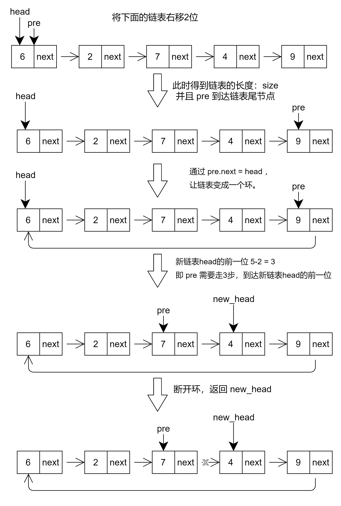

# 旋转链表-leetcode61

<a href="https://leetcode-cn.com/problems/rotate-list/" target="_blank">旋转链表</a>

给你一个链表的头节点 `head` ，旋转链表，将链表每个节点向右移动 `k` 个位置。

**示例1：**

```js
输入：head = [1,2,3,4,5], k=2
输出：[4,5,1,2,3]
```

**示例2：**

```js
输入：head = [0,1,2], 4
输出：[2,0,1]
```


**思路：**

1. 假设有个链表是 6->2->7->4->9，我们命名一个指针pre指向head。
2. 接下来，我们通过遍历，得到链表的长度size，此时pre到达链表的尾节点。
3. 通过 pre.next = head，让链表变成一个环。
4. 然后我们要计算新链表head的前一位，通过 size-k-1，在这里就是 5-2-1=2（此时k可能大于size，则进行取余操作 size - k%size - 1）
5. 通过遍历，pre指针走到旋转后头节点(head)的前一位，此时将head= pre.next，head被赋值后变成旋转后的头节点
6. 断开环：pre.next = null，最后返回head即可。





```js
var rotateRight = function(head, k) {
    if(!head) return head;
    let p = head, n = 1;
    // 数一下链表有多长
    while(p.next) p = p.next, n++;
    p.next = head; // 将链表连成环
    k %= n;
    k = n - k; // 这里不再减一，因为p目前是尾节点，需要多走一步
    while(k--) p = p.next;
    head = p.next;
    p.next = null;
    return head;
}
```


