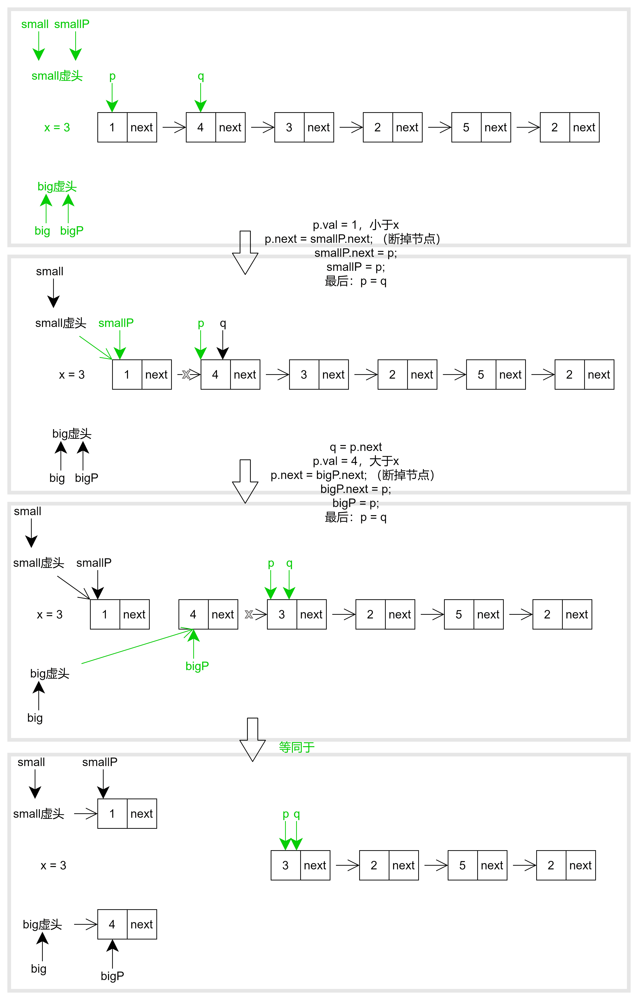

# 分隔链表-leetcode86

<a href="https://leetcode-cn.com/problems/partition-list/" target="_blank">分隔链表</a>

给你一个链表的头节点 head 和一个特定值 x ，请你对链表进行分隔，使得所有 小于 x 的节点都出现在 大于或等于 x 的节点之前。

你应当 保留 两个分区中每个节点的初始相对位置。


**示例1：**

```js
输入：head = [1,4,3,2,5,2], x = 3
输出：[1,2,2,4,3,5]
```


**思路：**

1. 分两个链表，big、small
2. 我们把小于 x 的节点，都往 small 去插入，把大于等于 x 的节点，都往 big 去插入
3. 扫描完一遍原链表后，就能得到两条单链表，我们把这两条链表立连起来就行了


```js
var partition = function(head, x) {
  if(!head) return head;
  let small = new ListNode(), big = new ListNode();
  let smallP = small, bigP = big;
  let p = head, q;
  while(p) {
    q = p.next; // 因为之后p.next会被断开，所以这里记录一下原链表中p的下一个节点
    if(p.val < x) {
      p.next = smallP.next; // 断开p
      smallP.next = p; // 把p接入samll
      smallP = p; // smallP指针移动到small链表的最后一位
    } else {
      p.next = bigP.next;
      bigP.next = p;
      bigP = p;
    }
    p = q; // p向后移动一位
  }
  smallP.next = big.next; // 两条链表相连接
  return small.next;
}
```





