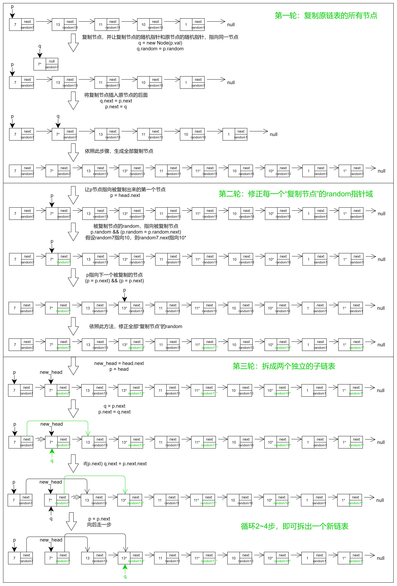

# 复制带随机指针的链表-leetcode138

<a href="https://leetcode-cn.com/problems/copy-list-with-random-pointer/" target="_blank">复制带随机指针的链表</a>


给你一个长度为 n 的链表，每个节点包含一个额外增加的随机指针 random ，该指针可以指向链表中的任何节点或空节点。

构造这个链表的 深拷贝。 深拷贝应该正好由 n 个 全新 节点组成，其中每个新节点的值都设为其对应的原节点的值。新节点的 next 指针和 random 指针也都应指向复制链表中的新节点，并使原链表和复制链表中的这些指针能够表示相同的链表状态。复制链表中的指针都不应指向原链表中的节点 。

例如，如果原链表中有 X 和 Y 两个节点，其中 X.random --> Y 。那么在复制链表中对应的两个节点 x 和 y ，同样有 x.random --> y 。

返回复制链表的头节点。

用一个由 n 个节点组成的链表来表示输入/输出中的链表。每个节点用一个 [val, random_index] 表示：

- val：一个表示 Node.val 的整数。
- random_index：随机指针指向的节点索引（范围从 0 到 n-1）；如果不指向任何节点，则为  null 。

你的代码只接受原链表的头节点 head 作为传入参数。


**思路：**

1. 首先将原链表两两复制：1=>2=>3=>4   变为   1=>1\*=>2=>2\*=>3=>3\*=>4=>4\*
2. 复制完成后，我们让他们的 random 指针域指向相同的节点，例如 1 => 3     到   1\*=>3
3. 这时候，实际 1\* 应该指向 3\*，那么 3\* 在哪儿呢，我们可以用 3.next 找到 3\* 节点


```js
/**
 * function Node(val, next, random) {
 *    this.val = val;
 *    this.next = next;
 *    this.random = random;
 * };
 */
var copyRandomList = function(head) {
  if(!head) return head;
  let p = head, q, new_head;
  // 第一轮：复制原链表的所有节点
  while(p) {
    q = new Node(p.val); // 复制节点
    q.random = p.random; // 让复制节点的随机指针域和原节点的随机指针域，指向同一个节点
    // 将复制节点插入原节点的后面
    q.next = p.next;
    p.next = q;
    // p往后走一步
    p = q.next;
  }
  // 第二轮：修正每一个“复制节点”的 random 指针域
  p = head.next; // 让p节点指向每一个被复制出来的节点
  while(p) {
    p.random && (p.random = p.random.next);
    (p = p.next) && (p = p.next);
  }
  // 第三轮：拆成两个独立的子链表
  new_head = head.next;
  p = head;
  while(p) {
    q = p.next;
    p.next = q.next;
    if(p.next) q.next = p.next.next;
    p = p.next; // 向后走一步
  }
  return new_head;
}
```




